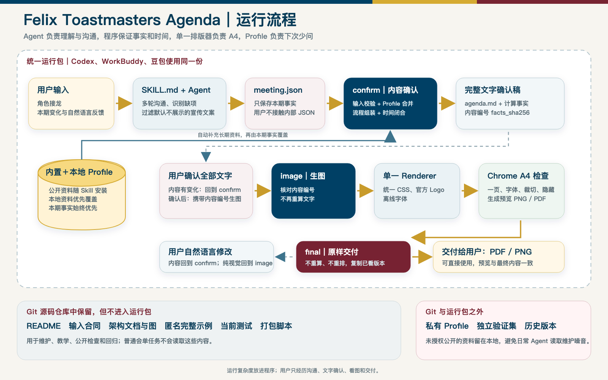
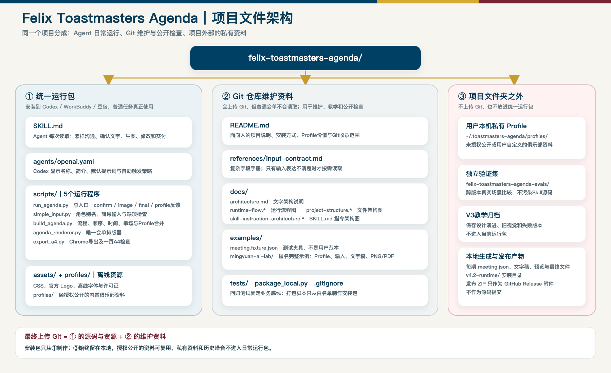
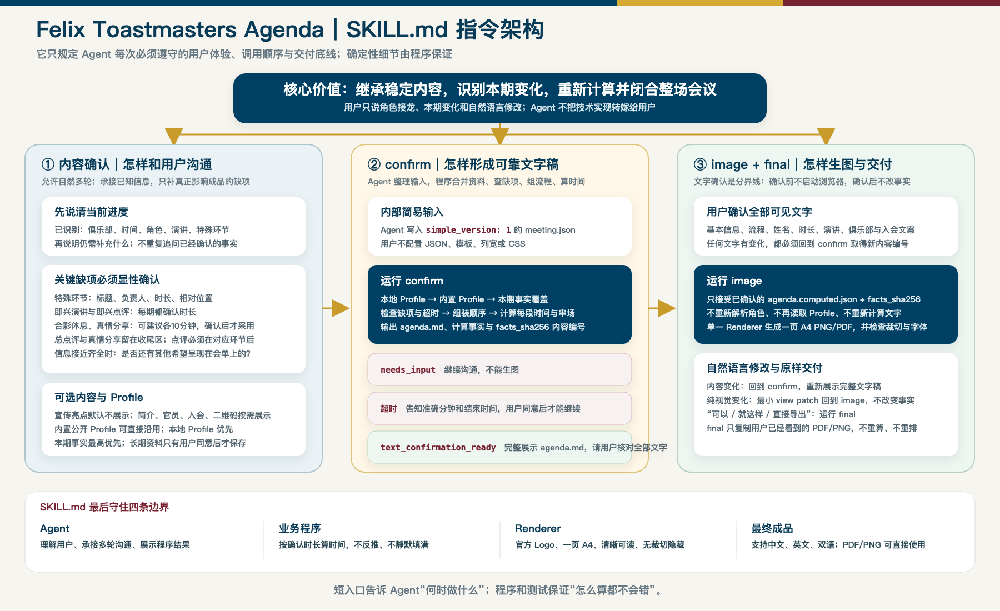

# 整体架构

这套 Skill 把语言理解、业务计算、排版导出和长期资料分开。普通任务只加载 `SKILL.md` 并调用程序，不读取本文件、测试或源码。

## 用户与 Agent

用户提供角色接龙和本期变化。Agent 根据 `SKILL.md`：

- 承接多轮沟通，不重复询问已确认信息；
- 过滤默认不进入会单的宣传文案；
- 显性确认负责人、特殊环节和关键时长；
- 区分本期事实与可以长期复用的俱乐部资料；
- 把确认内容整理成内部 `meeting.json`。

## 内容确认

`run_agenda.py confirm` 依次调用：

1. `simple_input.py`：识别角色别名并检查输入缺项；
2. 本地或内置 profile：补充俱乐部已经确认的长期资料；
3. `build_agenda.py`：组装环节、保护顺序、计算转场和整场时间；
4. 输出 `agenda.md`、`agenda.computed.json` 和对应内容编号。

用户看到完整文字确认稿。内容没有确认前，不启动浏览器，不生成图片。

## Profile

Profile 有两层：经过授权公开的俱乐部资料可放在 Skill 的 `profiles/` 中随安装包发布；用户自己确认或修改的资料保存在 `~/.toastmasters-agenda/profiles/`。本地 profile 优先于内置版本。

它可以保存俱乐部简介、常用地点、语言、官员名单、真实入会方式、嘉宾参与说明和已授权二维码。

主题、演讲、当期角色、临时地点和特殊环节不进入 profile。本期明确事实始终优先。只有程序真正创建或更新 profile 后，Agent 才能告诉用户已经记住了什么，以及下次不必重复提供什么。

## 生图与交付

用户确认文字后，`run_agenda.py image` 先核对内容编号，再把同一份 `agenda.computed.json` 交给：

- `agenda_renderer.py`：使用一个排版系统生成 HTML；
- `agenda.css`、官方 Logo 和离线字体：提供稳定视觉资源；
- `export_a4.py`：使用 Chrome 导出一页 A4 PDF/PNG，并检查字体、裁切、隐藏、溢出和第二页。

`final` 只把用户已经看到的预览文件原样交付，不重新计算或排版。

## 资料分层

- **运行包**：`SKILL.md`、Agent 元数据、5个运行脚本、CSS、官方 Logo、字体及许可证，以及经过授权公开的内置 profile。
- **仓库维护资料**：README、输入合同、架构文档、匿名完整示例和测试。
- **仓库之外**：独立验证集、用户本机私有 profile、历史教学版本和每次生成结果。

`package_local.py` 使用明确白名单制作统一安装包，并在打包前检查私人路径、电话号码和邮箱等内容。
