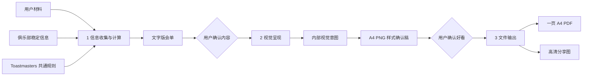

# Felix Toastmasters Agenda V3 架构

更新时间：2026-09-01  
状态：V3 三层新通道已实现并通过三类真实 A4 压测；V2 仅保留历史兼容
适用：后续 Skill 流程、视觉系统和代码重构的唯一方向

## 1. 核心决定

会单 Skill 面向用户只保留三层：

1. 信息收集与计算；
2. 视觉呈现；
3. 文件输出。

`meeting.json`、俱乐部 Profile、Toastmasters 规则、确定性时间计算和 HTML 渲染器都只是三层内部实现，不是用户需要理解的独立层。

退役按“标准例会 / 工作坊 / 演讲马拉松”选择整套模板的路由。保留基于内容语义和真实渲染尺寸的组件组合：有内容才生成组件，特殊会议在同一设计系统中调整重点、行数、列数和信息位置。



两次用户确认是架构的一部分：

- 文字确认回答“这场会议到底有什么”；
- 样式确认回答“这样呈现是否清楚、好看”。

AI 不能用自动检查代替人的审美判断。人类是视觉层的最终判断者。

## 2. 第一层：信息收集与计算

### 要回答的问题

> 这场会议有什么环节，谁负责，几点开始，几点结束？

### AI 负责

- 理解自然语言、角色接龙、会议说明和可选旧会单；
- 识别本期明确事实；
- 继承俱乐部名称、地点、语言和已确认的稳定信息；
- 主动发现真正缺失的信息，一次问完；
- 理解工作坊、比赛、马拉松、双语会议和临时加列等特殊情况；
- 根据用户选择增减时间官规则、头马介绍、俱乐部介绍等固定内容。

### 程序负责

- 组装标准环节和角色触发环节；
- 保留本期明确顺序；
- 计算默认时长、转场和灵活环节；
- 检查负责人、角色关系和时间闭合，并对明显超量做粗略预警；
- 生成唯一计算真源 `agenda.computed.json`。

### 用户看到的结果

一份自然语言可读的 `agenda.md`，清楚写出：

- 本期基本信息；
- 完整流程；
- 每个环节的开始时间、负责人和时长；
- 幕后角色；
- 本期选择的固定信息组件。

用户确认前，不进入视觉制作。内容变化返回本层重新计算。

### 本层检查

- 事实是否来自当前材料或已确认稳定信息；
- 是否仍有缺负责人、缺时长或含义冲突；
- 角色不存在时是否错误生成了对应环节；
- 特殊环节是否有真实姓名、时长和位置；
- 时间是否准确闭合；
- 私密会员资料是否被排除。

## 3. 第二层：视觉呈现

### 要回答的问题

> 同一份已确认内容，怎样让人一眼看清重点，同时保持整齐、克制和专业？

### 视觉目标

- 整齐；
- 清晰；
- 简约高级；
- 字能看清；
- 重点、对齐、留白、对比正确；
- 符合 Toastmasters 品牌底线。

不把“花哨、主题特效、模板数量”当作设计能力。

### 单一设计系统，不是一张死模板

只维护一套经人类确认的字体、色彩、网格、间距和组件语言。下面是可组合的语义组件，不是每张会单必须占用的固定区域：

1. 品牌页头；
2. 日期、时间、地点、今日一词和会议经理；
3. 主议程；
4. 可选运营信息区；
5. 可选背景信息区；
6. 品牌页脚。

组件只有在有内容时才生成，并按阅读顺序和真实尺寸进入自然文档流。同一设计系统允许内容变化：

- 议程可增减行；
- 可增加 Pathways 等可选列；
- 重点环节可获得更强字号、颜色和位置；
- 后台角色、时间官规则、官员团队可进入运营信息区；
- 头马介绍、会议边界和俱乐部介绍可进入底部背景信息区。

这是同一视觉语法中的组件级组合，不是按会议类型选择另一套模板。单一的是视觉秩序，不是内容永远放在同一个位置。

### AI 必须先判断两条重点轴

视觉制作开始前，AI 必须分开判断：

- **使用重点**：现场必须快速扫到的时间、环节、负责人、时长和必要辅助列；
- **内容强调**：本期工作坊、主题演讲或其他值得突出呈现的内容。

主流程始终是使用重点。内容强调不能遮蔽主流程，也不能直接兑换成更大面积。

AI 还必须基于已确认会单明确：

- 第一重点是什么；
- 主流程中哪些信息需要快速扫描；
- 哪些是现场辅助信息；
- 哪些只是背景资料；
- 哪些区域需要呼吸空间；
- 哪些区域绝不能出现内部死空白。

重点由业务意义决定，不由时长、字符数或剩余面积决定。

例如，60 分钟工作坊可以是最强内容强调，但“60 分钟”只是一项时间事实，不能自动换算成占据半页的色块。

### 内部视觉意图

AI 的层级判断必须形成一个受约束的内部结果 `agenda.view.json`，不能只存在于模型脑中，也不要求用户配置。

完整字段合同见 [V3 视觉意图](v3-view-intent.md)。

它只表达语义：

- 本期需要强调的环节 ID；
- 主流程需要显示的列和阅读顺序；
- 运营信息与背景信息的组件顺序；
- 运营信息与背景信息的分组和阅读顺序；
- 整体密度和有限的视觉变量。

它不包含像素坐标、自由 HTML、任意 CSS、模板名称或按时长计算的面积。它不是第四个用户层，也不是恢复版式路由；它是“AI 理解信息意义”和“程序稳定排版”之间的桥。

### 程序固定什么

- A4 画布、安全边距和打印区域；
- 官方 Logo 与品牌色边界；
- 本地字体和最低字号；
- 语义化 HTML 结构；
- 主议程全局列线；
- 自然文档流和组件自然高度；
- 有内容才生成组件，不生成空列、空栏和空卡；
- 同类基线、内边距范围和组件内容高度上限；
- 内容不可被视觉层改写；
- 不裁切、不隐藏、不通过整体缩放伪造单页。

### AI 可以调整什么

- 本期视觉意图中的重点、列、阅读顺序和组件语义位置；
- 设计系统允许范围内的字号档位、强调强度、对比度和密度变量；
- 用户反馈对应的低风险视觉变量。

日常模型默认不直接重写 HTML / CSS。现有视觉意图和设计变量确实表达不了的特殊要求，才允许在本期输出目录做局部 CSS 试验；试验不得修改母版，渲染后仍须由用户确认。被多次验证且具备复用价值的改法，才进入基础设计系统。

### 留白规则

> 留白留在内容组之间，不留在有边框的组件里面。

允许的留白：

- 页面边缘；
- 页头与元信息之间；
- 主标题周围；
- 议程、运营信息和背景信息之间；
- 重点内容内部必要的呼吸空间。

不允许的留白：

- 为了填满页面强行拉高卡片；
- 短内容组件内部的大面积空白；
- 职务和姓名之间失去关系的空洞；
- 缺失内容仍保留的空栏或空卡；
- 用时长比例决定视觉高度产生的死区。

内容组件使用自然高度。页面可以有外部呼吸空间，不能把空白封进边框冒充布局。

### 对齐规则

- 时间、环节、负责人、可选列和时长共享同一套全局列；
- 阶段标题与阶段时间使用固定锚点；
- 同类模块标题、正文和数值使用一致基线；
- 负责人和其附属信息必须保持可见关系；
- 不用多个局部网格模拟同一张表。

### 对比规则

- 主标题、重点环节、普通流程和背景信息形成清楚的四级层级；
- 强调靠字号、字重、位置和有限颜色完成；
- 酒红只用于真正重点，不大面积填充无内容区域；
- Pathways 等辅助列比负责人弱，不与主流程竞争；
- 背景介绍可读但不抢现场流程。

### 用户看到的结果

HTML 是内部文件。默认给用户看由最终 A4 页面真实渲染出的确认稿，不直接称为最终会单：

- 一张整页缩略图，用于判断重点、整体密度和大块死空白；
- 一张主流程 100% 局部，用于判断字号、列线和对齐。

用户可以直接说：

- 字大一点；
- 重点太夸张；
- 这里不要空；
- 负责人靠近一点；
- 这块放到底部；
- 这个版本好看。

视觉反馈只留在本层，不重新计算会议事实。用户确认好看后才进入文件输出。

只有同一俱乐部明确要求“沿用已经确认的样式直接出”时，才可跳过重复样式确认；程序仍须生成并检查预览，不能跳过视觉层。

### 本层检查

- 视觉内容是否与确认后的计算真源一致；
- 第一眼是否看见正确重点；
- 主流程是否可快速扫描；
- 字号是否真实可读；
- 列线、基线和边缘是否对齐；
- 留白是否服务层级，而不是内部死区；
- 颜色和 Logo 是否符合 Toastmasters 规范；
- AI 是否查看了真实渲染图，而不是只检查源码；
- 用户是否明确确认样式。

自动检查只能发现裁切、错位、溢出和字号下限，不能证明“好看”。

真实单页容量只能在本层根据最终字体、列宽、语言和组件高度判断。装不下时返回信息层让用户选择删减或调整内容；不能用行数阈值代替，也不能自动缩成小字。

## 4. 第三层：文件输出

### 要回答的问题

> 已确认的样式，如何快速、稳定、清晰地变成可打印和可分享文件？

### 程序负责

- 将已确认 HTML 导出为一页 A4 PDF；
- 从同一 HTML 生成高清 PNG；
- 嵌入或打包字体和官方品牌资产；
- 保证 PDF 与 PNG 内容一致；
- 使用稳定、清楚的文件名；
- 失败时保留上一版，不交付半成品。

本层不得重新选择重点、调整内容或改变设计。

### 本层检查

- PDF 是否且仅有一页 A4；
- PNG 是否达到分享清晰度；
- 字体是否正确加载；
- 是否存在裁切、重叠、第二页或黑块；
- HTML、PDF 和 PNG 是否完全一致；
- 文件是否可以正常打开。

### 用户看到的结果

- 一页 A4 PDF；
- 高清 PNG；
- 必要时保留 HTML。

## 5. 目标技术结构

```text
用户材料 + Profile + Toastmasters 规则
                ↓
AI 理解与补问
                ↓
meeting.json
                ↓
build_agenda.py
                ↓
agenda.computed.json + agenda.md
                ↓
用户确认内容
                ↓
AI 生成 agenda.view.json
                ↓
单一 semantic HTML renderer + 一套已确认设计系统
                ↓
agenda.preview.html + agenda.preview.png
                ↓
用户确认样式
                ↓
export_a4.py
                ↓
agenda.pdf + agenda.png
```

目标代码边界：

| 组件 | 目标职责 |
|---|---|
| `SKILL.md` | 三层用户流程、询问与确认规则 |
| `profiles/` | 俱乐部长期稳定信息 |
| `build_agenda.py` | 事实组装、时间计算、冲突发现；不生成视觉 |
| `agenda.view.json` | AI 生成的本期视觉意图，不对用户暴露 |
| `agenda_renderer.py` | 根据视觉意图，用单一语义结构确定性生成确认稿 |
| `assets/agenda.css` | 一套经确认的视觉系统和打印字体 |
| `export_a4.py` | 文件导出与格式完整性检查 |
| `run_agenda.py` | 串联草稿、预览和最终导出三个动作 |

## 6. 现有实现如何处理

| 现有实现 | 决定 |
|---|---|
| `standard / feature / marathon` Layout Router | 退役按会议类型切换模板；保留内容驱动的组件级组合 |
| `classic / editorial` 两个 renderer | 合并为一个 renderer |
| 按时长放大重点块 | 删除；重点面积由内容和层级决定 |
| `flex: 1`、等高卡片填满页面 | 禁止用于内容模块 |
| `visual_theme` 自动主题路由 | 从默认流程移除；只有用户明确要求创意主题时再处理 |
| 浏览器视觉检查 | 拆回视觉层和输出层各自检查，不独立成层 |
| `export_a4.py` 的审美判断 | 移出；只保留页数、字体、裁切和文件检查 |

迁移期间保留旧代码用于已有成品回放，但新功能不得继续增加到 Layout Router 或第二套 renderer。

## 7. 这套架构能解决什么

能够解决：

- AI 过早跳过文字确认；
- 内容变化和视觉变化互相污染；
- 版式路由选错导致整页方向错误；
- 每种会议维护一套模板导致复杂度持续增长；
- 技术检查通过却视觉失败；
- 用户只想改字号，却触发整条业务重算；
- 导出问题和审美问题混在一起排查；
- 国产模型或新手用户被迫理解内部配置。

不能自动解决：

- AI 第一次就拥有稳定的人类审美；
- 任意多内容都能塞进一页 A4；
- 未经确认的视觉稿自动变好看；
- 一个从未经过人类确认的基础视觉系统自行达到高水平。

这些问题用三个机制处理：

1. 一套由人类确认的基础视觉系统；
2. AI 把层级判断写成受约束的视觉意图；
3. 确定性 renderer 保证视觉秩序；
4. 用户保留最终审美确认权。

这不是把人类判断当作临时补丁，而是承认视觉设计本来就需要人的智慧。

## 8. 迁移顺序

只按以下顺序推进，不同时大改：

1. **流程先行**：改写 `SKILL.md`，恢复文字确认和样式确认；
2. **确定 V3 视觉基线**：同一 renderer 同时通过普通例会、60 分钟重点环节、角色密集 / 双语会单三份真实压力样本；它们是测试样本，不是三套模板；
3. **拆出视觉层**：把 HTML / CSS 从 `build_agenda.py` 移到独立 renderer；
4. **退役路由**：移除新增调用，保留旧版本回放；
5. **简化导出**：让 `export_a4.py` 只做文件工作；
6. **真实复测**：普通例会、重点环节、角色密集会单都使用同一视觉系统测试；
7. **最后安装发布**：真实使用确认后再更新 WorkBuddy 和 GitHub。

每一步单独确认。前一步没有被真实结果证明，不进入下一步。

## 9. 停止条件

- 用户确认文字内容后，内容层停止修改；
- 用户确认样式后，视觉层停止修改；
- 用户明确要求沿用已确认视觉基线时，可以跳过重复审美询问，但不能跳过内部预览与检查；
- 文件导出成功后，不再追加设计变化；
- 出现内容容量冲突时，回到相应层请用户取舍，不自行缩字或隐藏；
- 现有成品可用时，任何失败版本都不得覆盖它。

## 10. 版本策略

- GitHub 主分支始终保存最新可运行的 V3 迁移状态；迁移期允许保留 V2 兼容代码，但新流程与新功能只按 V3 架构推进；
- V2 作为失败版本冻结，不再继续修补或扩展；
- 本地教学目录保留 V2 失败成品、V2 源码快照、V3 架构稿和 V3 后续阶段成品；
- 教学快照不参与运行，不与 GitHub 主分支竞争当前真源；
- 每次进入下一个迁移阶段前，先保存本地快照，方便复盘“哪里错、为什么改、结果如何”。
